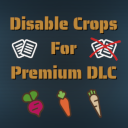

## [DisableCrops](https://github.com/VidhosticeSDK/FS22_DisableCrops)

Tento mod vypne generování určených plodin z "DLC Premium Expansion" (červená řepa, mrkev, pastiňák) na nevlastněných polích. Je vhodný pro mapy, kde jsou příliš velká pole, nebo pole rozmanitých tvarů. Na vlastněná pole se omezení nevstahuje.

Aktivace při:
- nová hra - nebudou generovány vybrané plodiny na žádném nevlastněném poli.
- rozehraná hra - již vygenerované plodiny na nevlastněných polích zůstanou do konce sezóny a mohou být nabízeny zakázky na jejich sklizeň. Pokud se nesklidí, plodiny uvadnou a další rok se již generovat nebudou.

Ke stažení: [FS22_DisableCrops.zip](https://github.com/VidhosticeSDK/FS22_DisableCrops/releases/download/v1.0.0.0/FS22_DisableCrops.zip)

