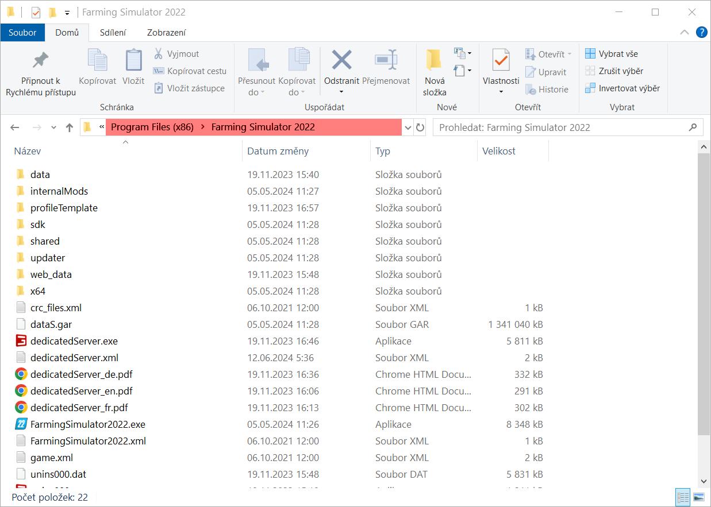
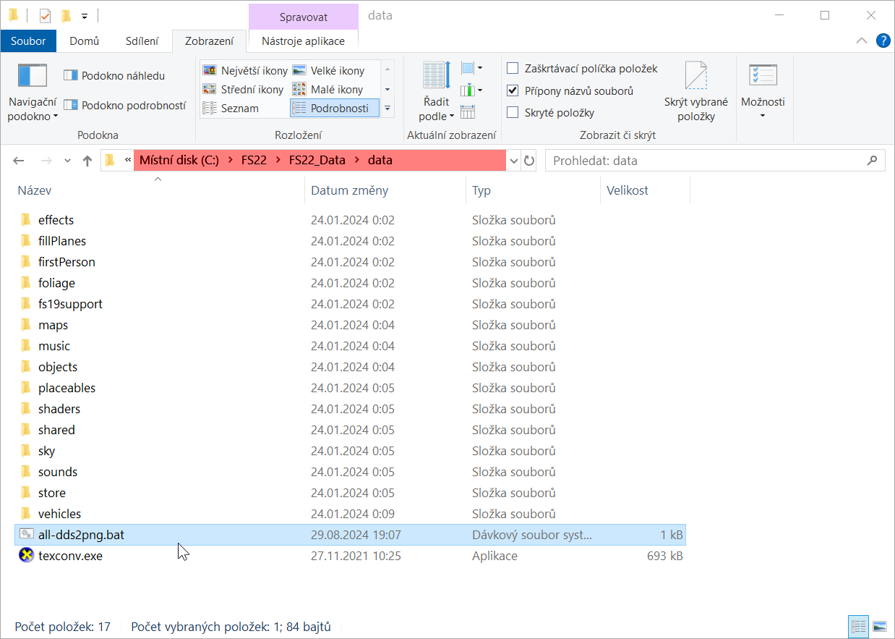

# Kopie hry

Nejprve musíme zkopírovat celou složku hry z místa kde máme hru nainstalovanou:

- GIANTS distribuce: `C:\Program Files (x86)\Farming Simulator 2022\`
- Steam: `C:\Program Files (x86)\Steam\steamapps\common\Farming Simulator 22`
- Epic: `C:\Program Files\Epic Games\Farming Simulator 22`



zkopírujeme do: `C:\FS22\FS22_Data\`


a zde ve složce `data` rozbalíme z tohoto archívu: [all-dds2png.zip](all-dds2png.zip)
<br/>
soubory `all-dds2png.bat` a `texconv.exe`



`texconv.exe` lze také stáhnout zde: <https://github.com/Microsoft/DirectXTex/releases/latest/download/texconv.exe>

dávkový soubor `all-dds2png.bat` obsahuje:

```bash
@echo off

texconv.exe -ft PNG -r:keep *.dds

echo.
echo HOTOVO / DONE
echo.
pause
```

po spuštění `all-dds2png.bat` proběhne **převod všech obrázků ve formátu DDS na formát PNG** _(je to z důvodu nefunkční podpory některých typů/druhů DDS v Blenderu)_.

---

Samotný převod trvá poměrně dlouho a po převodu složka nabyde na \~56 GB (původní velikost \~35 GB).

---

Vypadá to jako plýtvání místem na disku C:\\, ale pokud si v této kopii něco rozbijete, tak to nebude mít
žádný negativní vliv na samotnou hru a také máte přístup ke všem obrázkům v mnohem lepším formátu PNG
_(DDS zhoršuje postupným přeukládáním kvalitu výsledného obrázku)_.

---

Ke stažení:
- [all-dds2png.zip](all-dds2png.zip)
