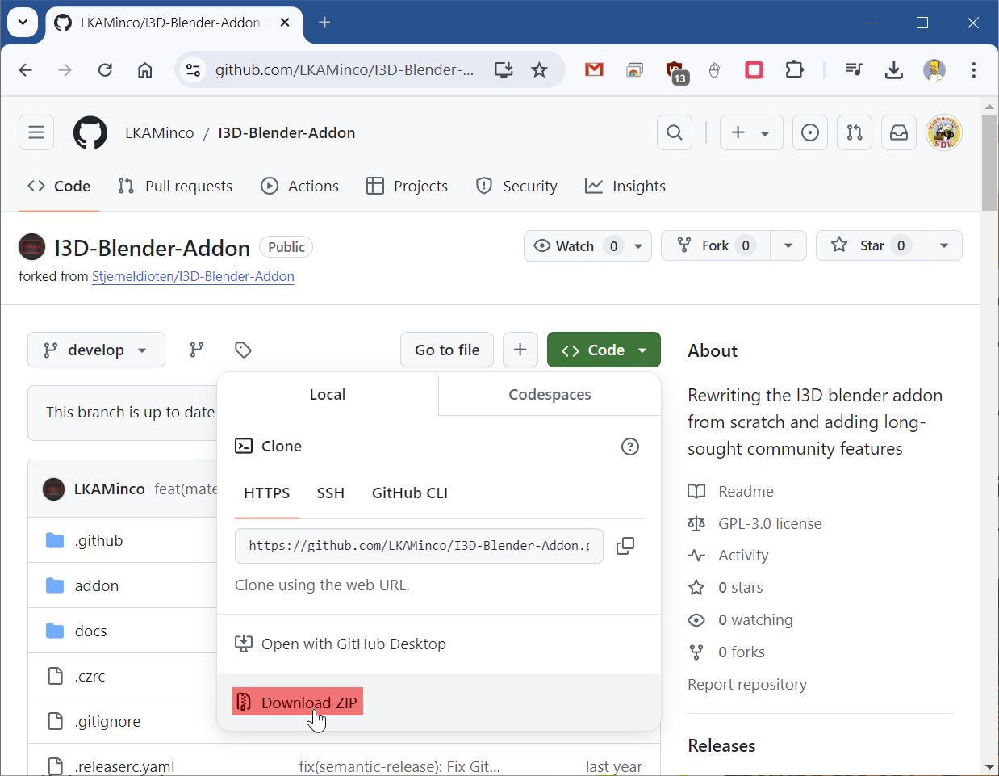
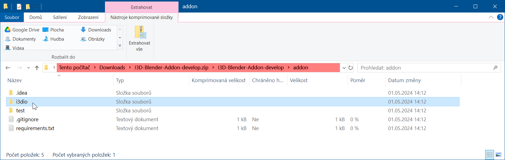
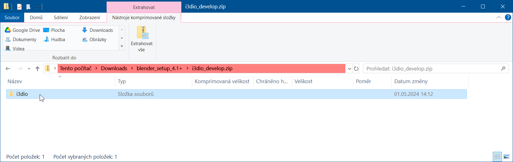
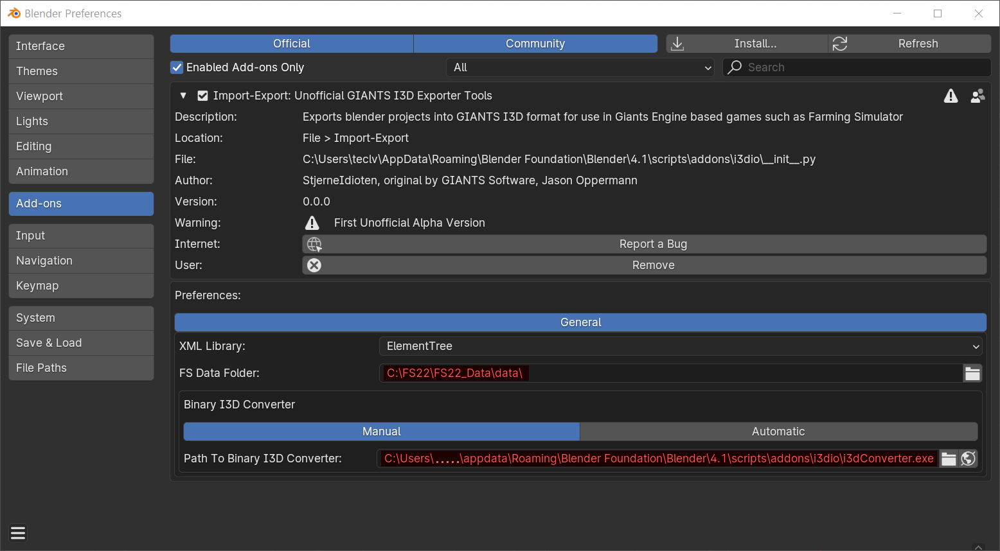
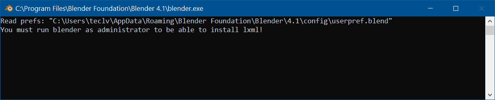
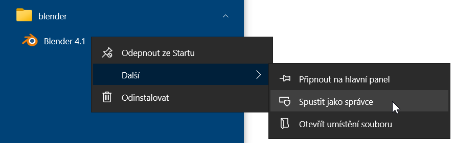
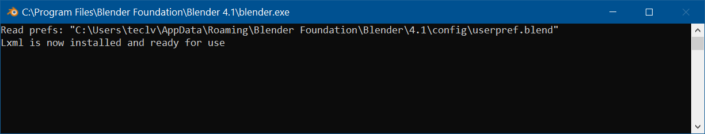
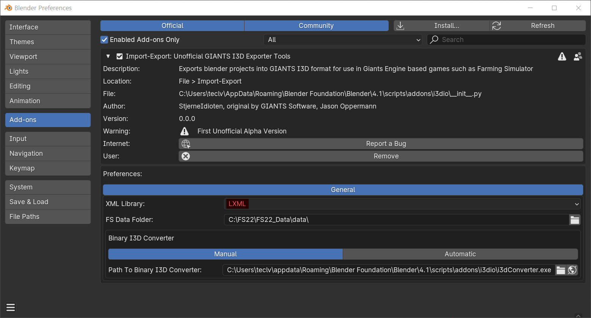
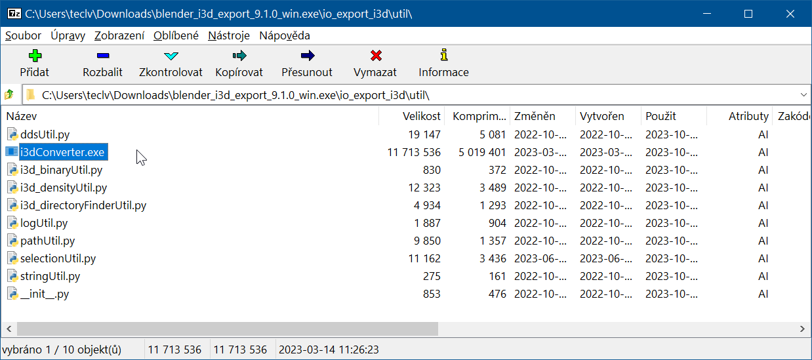
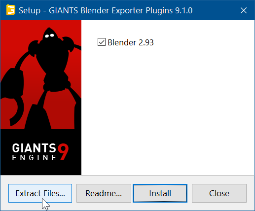

# I3D-Blender-Addon

## Stažení doplňku

- [I3D-Blender-Addon (LKAMinco)](https://github.com/LKAMinco/I3D-Blender-Addon/tree/develop) nebo [I3D-Blender-Addon (StjerneIdioten)](https://github.com/StjerneIdioten/I3D-Blender-Addon/tree/develop)

  
  stáhne se soubor `I3D-Blender-Addon-develop.zip`

  
  z tohoto archívu je potřeba vzít pouze složku `i3dio` a tuto složku znovu zabalit do `i3dio_develop.zip`

  

## Nastavení doplňku

1. 

1. 

1. 
   _(stačí spustit jako správce pouze jednou)_

1. 

1. 

---

#### i3dConverter.exe _(umožní exportéru ukládat binární .shape soubory)_

<https://gdn.giants-software.com/downloads.php>

[Blender Exporter Plugins v9.1.0](https://gdn.giants-software.com/download.php?downloadId=120)
_(v tuto chvíli doplněk nepodporuje Blender verze 4 a vyšší)_

 I tak z něj můžeme získat soubor i3dConverter.exe a použít ho v komunitním exportéru.

 Stačí ho rozbalit do dočasné složky a zkopírovat do:
 `c:\Users\....\AppData\Roaming\Blender Foundation\Blender\4.1\scripts\addons\i3dio\`

---

Ke stažení:
- [i3dio_develop.zip](i3dio_develop.zip)
