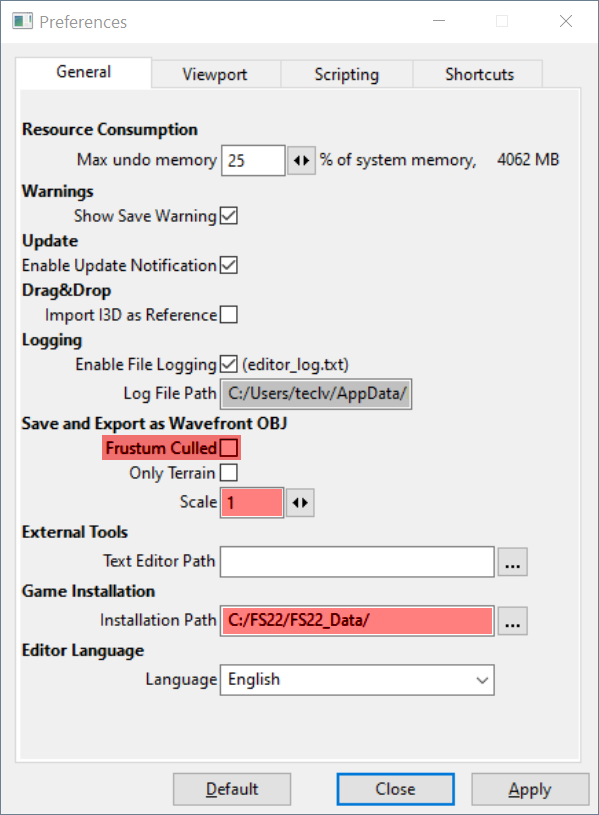

## Nastavení GIANTS editoru

V menu: File > Preferenses...

Je potřeba mít:

- **Frustum Culled: vypnuto**
   _Pokud je zapnuto "Frustum Culled" tak se neexportuje do `.obj` to co není vidět kamerou (v 3D pohledu editoru)._

- **Scale: 1**
   _"Scale" nastavené na 1 exportuje model 1:1 (v metrech)._

- **Installation Path: `C:/FS22/FS22_Data/`**

