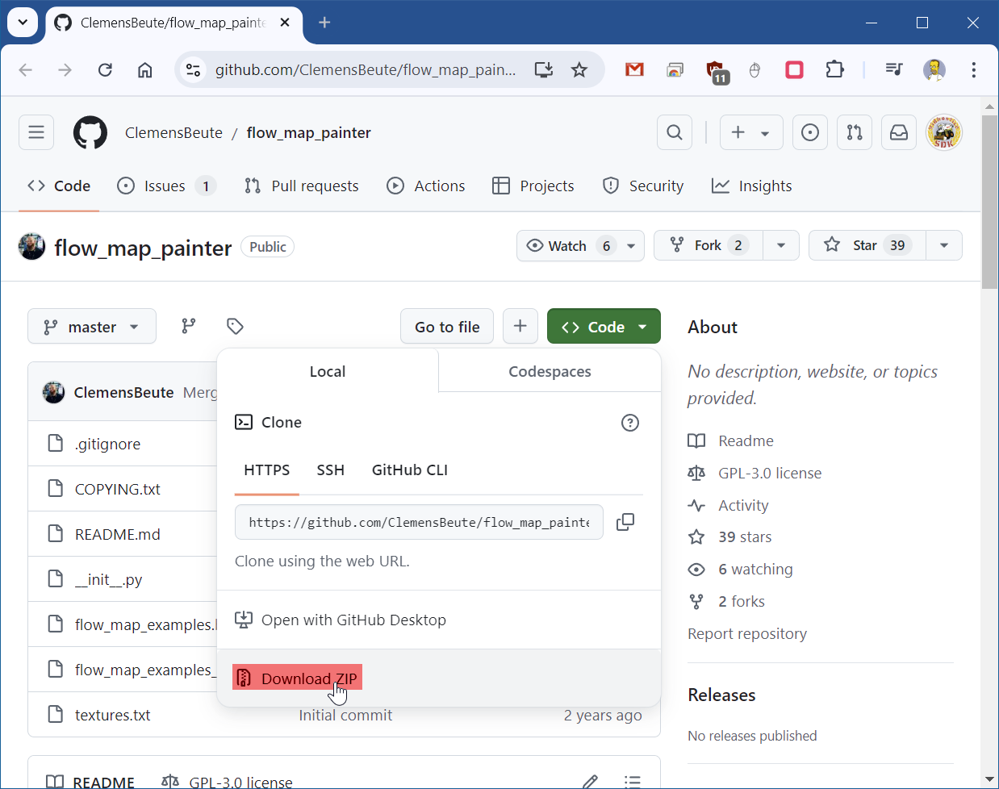
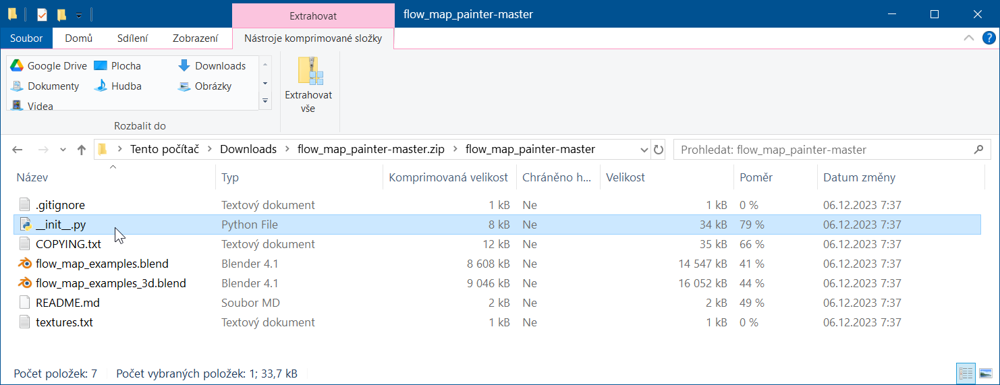
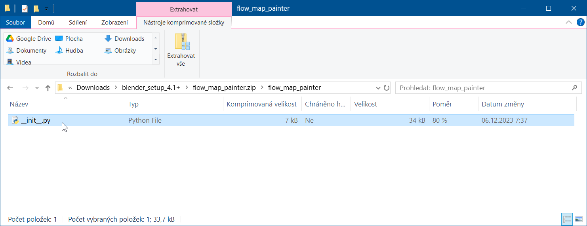

## Flow-Map-Painter

### Návod na použití

- [clemensbeute.gumroad.com/l/heZDT](https://clemensbeute.gumroad.com/l/heZDT)

### Stažení doplňku

- [flow_map_painter](https://github.com/ClemensBeute/flow_map_painter)

  
  stáhne se soubor `flow_map_painter-master.zip`

  
  z tohoto archívu je potřeba vzít pouze soubor `__init__.py` a tento soubor vložit do složky `flow_map_painter` znovu zabalit do `flow_map_painter.zip`

  

---

Ke stažení:
- [flow_map_painter.zip](flow_map_painter.zip)
