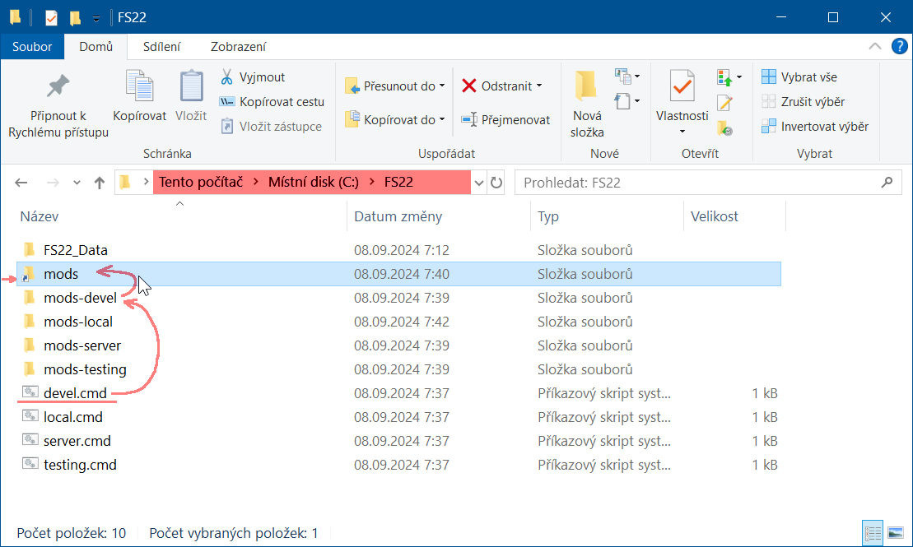
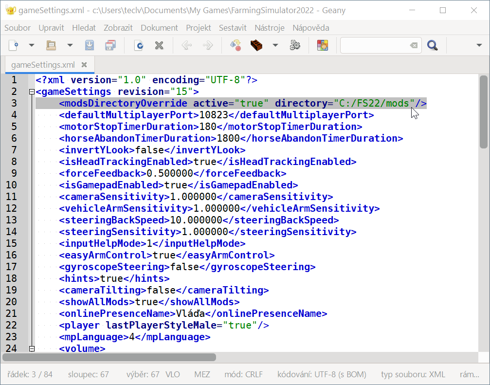

## Přepínání složek s módy

pokud chcete mít jednoduchý přepínač různých kolekcí módů _(například pro "vývoj", "lokální hraní", "dedikovaný server", "testování")_ 
stáhněte si [FS22_switch_moddir.zip](FS22_switch_moddir.zip) a rozbalte ho přímo na disk `C:\`



a upravte nastavení v souboru `C:\Users\....\Documents\My Games\FarmingSimulator2022\gameSettings.xml`



takto:

```xml
<modsDirectoryOverride active="true" directory="C:/FS22/mods"/>
```

---

**Nyní můžete přepínat různé kolekce módů pomocí spustitelných souborů:**
<br/>`devel.cmd`&nbsp;&nbsp;&nbsp;&nbsp;&nbsp;&nbsp;_(pro vývoj)_
<br/>`local.cmd`&nbsp;&nbsp;&nbsp;&nbsp;&nbsp;&nbsp;_(pro lokální hraní)_
<br/>`server.cmd`&nbsp;&nbsp;&nbsp;&nbsp;_(pro dedikovaný server)_
<br/>`testing.cmd`&nbsp;&nbsp;_(pro testování)_

Můžete si vytvořit vlastní soubor `xxxx.cmd` přejmenováním nebo zkopírováním _(script podle svého jména vytvoří složku `mods-xxxx` a nalinkuje do ní složku mods)_.

Složka `mods` je pouze "junction link" neboli odkaz na složku kterou jste zvolili spuštěním příslušného souboru `xxxx.cmd`

---

**Od této chvíle používejte příslušné složky pro práci s módy a složku `C:\FS22\mods` nepoužívejte!**

---

##### devel.cmd

```bash
@echo off
echo FS22 moddir: "%~n0"

rmdir C:\FS22\mods
echo.
mkdir "C:\FS22\mods-%~n0"
if not exist "mods-%~n0\_%~n0_" (
    type nul > "mods-%~n0\_%~n0_"
)
echo.
mklink /j C:\FS22\mods "C:\FS22\mods-%~n0"
echo.

echo HOTOVO / DONE
REM pause
```

---

Ke stažení:
- [FS22_switch_moddir.zip](FS22_switch_moddir.zip)
