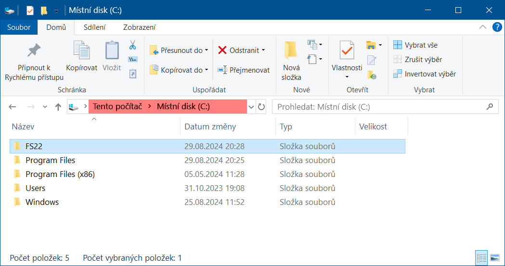
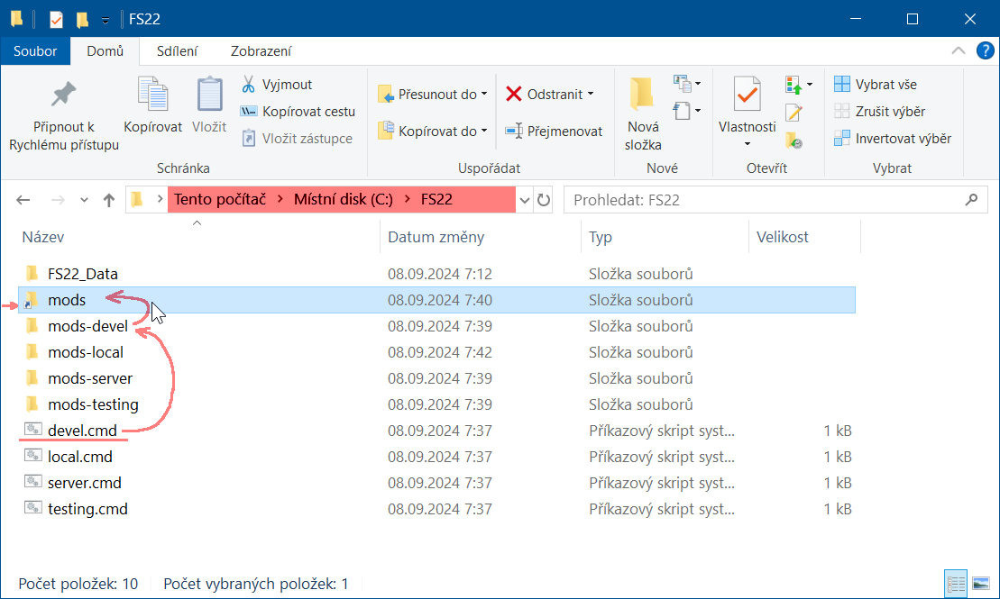
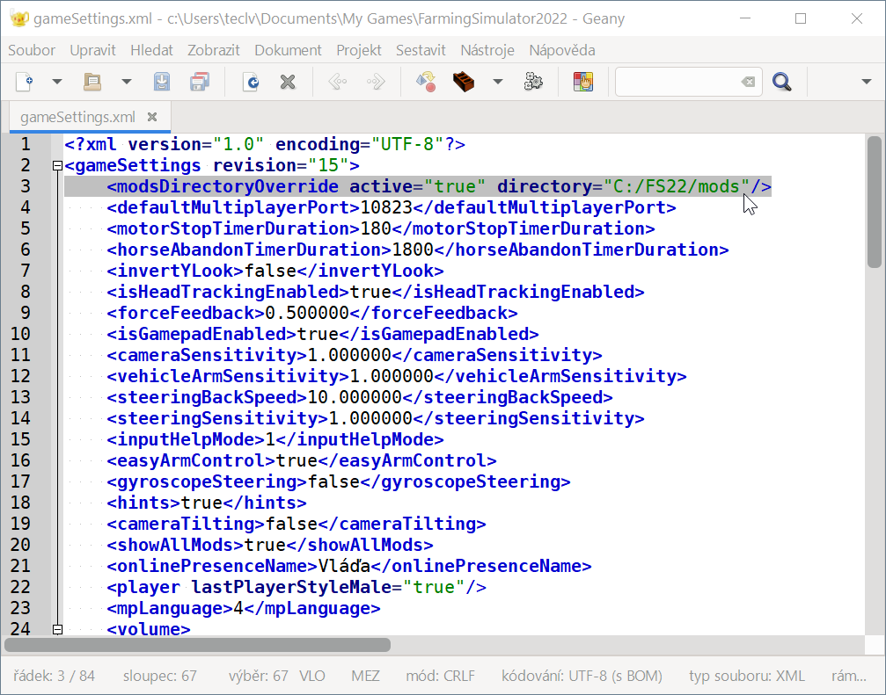

# Vidhostice SDK

Pro správnou funkci našich 'postupů', 'návodů', 'scriptů' a 'stáhnutelných souborů' bude potřeba nejprve nachystat:

1. Na disku C: vytvořit hlavní složku `FS22`

   

1. [Kopie hry](01_game_folder/01_game_folder.md)

1. [Nastavení GIANTS editoru](02_giants_editor/02_giants_editor.md)

1. [Nastavení Blenderu](03_blender/03_blender.md)

---

## Jednoduché přepínání složky s módy

pokud chcete mít jednoduchý přepínač různých kolekcí módů _(například pro "vývoj", "lokální hraní", "dedikovaný server", "testování")_ 
stáhněte si [FS22_switch_moddir.zip](FS22_switch_moddir.zip) a rozbalte ho přímo na disk `C:\`



a upravte nastavení v souboru `C:\Users\....\Documents\My Games\FarmingSimulator2022\gameSettings.xml`



takto:

```xml
<modsDirectoryOverride active="true" directory="C:/FS22/mods"/>
```

---

Nyní můžete přepínat různé kolekce módů pomocí spustitelných souborů:
<br/>`devel.cmd`
<br/>`local.cmd`
<br/>`server.cmd`
<br/>`testing.cmd`

Můžete si vytvořit vlastní soubor `xxxx.cmd` přejmenováním nebo zkopírováním _(script podle svého jména vytvoří složku `mods-xxxx` a nalinkuje do ní složku mods)_.

Složka `mods` je pouze "junction link" neboli odkaz na složku kterou jste zvolili spuštěním příslušného souboru `xxxx.cmd`

---

**Od této chvíle používejte příslušné složky pro práci s módy a složku `C:\FS22\mods` nepoužívejte!**

---

##### devel.cmd

```bash
rmdir C:\FS22\mods
mkdir "C:\FS22\mods-%~n0"
mklink /j C:\FS22\mods "C:\FS22\mods-%~n0"
```

---

Ke stažení:
- [FS22_switch_moddir.zip](FS22_switch_moddir.zip)
