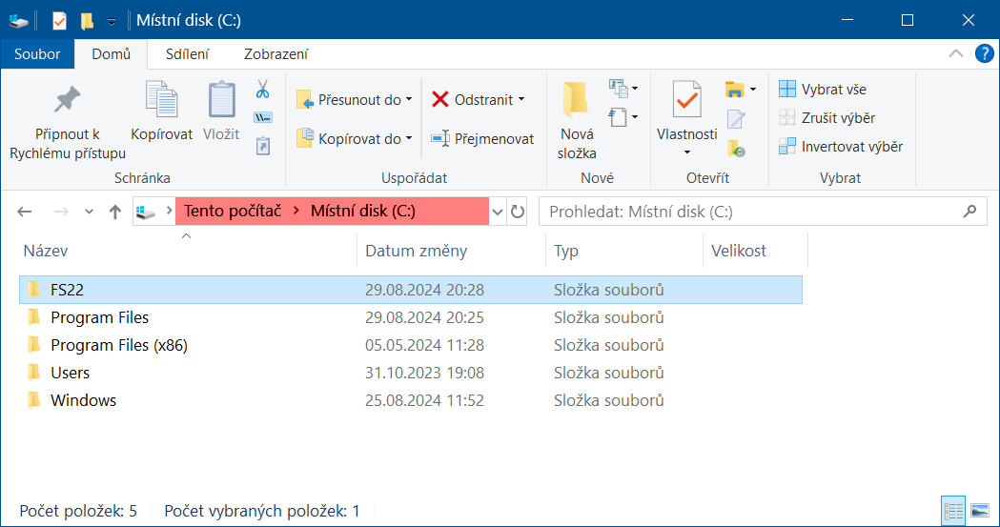

# Vidhostice SDK

Pro správnou funkci našich 'postupů', 'návodů', 'scriptů' a 'stáhnutelných souborů' bude potřeba nejprve nachystat:

1. Na disku C: vytvořit hlavní složku `FS22`

   

1. [Kopie hry](01_game_folder/01_game_folder.md)

1. [Nastavení GIANTS editoru](02_giants_editor/02_giants_editor.md)

1. [Nastavení Blenderu](03_blender/03_blender.md)
