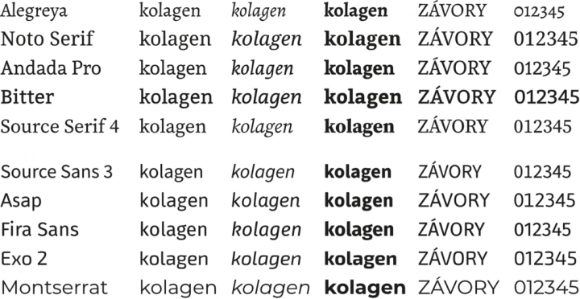

## Písma

### [www.fontsquirrel.com](https://www.fontsquirrel.com/)

[Most Popular Fonts](https://www.fontsquirrel.com/fonts/list/popular)

---

**ROOT.CZ** [Písma a jejich použití: výběr písma, které dobře vypadá a dobře se čte](https://www.root.cz/clanky/pisma-a-jejich-pouziti-vyber-pisma-ktere-dobre-vypada-a-dobre-se-cte)

Na závěr zkusím doporučit několik konkrétních volných písem, která považuji za kvalitní a univerzálně použitelná. Pokud sáhnete po některém z nich, neuděláte podle mého názoru chybu.

### Serifová písma

[**Alegreya**](https://fonts.google.com/specimen/Alegreya) je písmo, které jsem tu opakovaně zmiňoval a používal v řadě ukázek. Je dobře čitelné a výborně technicky provedené. Patří mezi zdobnější písma, pro vysloveně účelové texty bych je nepoužíval.

[**Noto Serif**](https://fonts.google.com/noto/specimen/Noto+Serif) je další písmo, které jste v textu opakovaně potkávali. Tentokrát se jedná o písmo dost střízlivé kresby s velkou střední výškou. Díky proměnlivé šířce a široké nabídce duktů je mimořádně flexibilní.

[**Andada Pro**](https://fonts.google.com/specimen/Andada+Pro) má kresbu podobnou předchozímu, ale menší rozdíly v tloušťce tahů a silnější serify. Patří do kategorie označované v angličtině slab serif (česky lineární serifové), která je typická svými výraznými serify.

[**Bitter**](https://fonts.google.com/specimen/Bitter) je ještě typičtějším představitelem lineárních serifových písem. Písmo bylo navrhováno s cílem, aby bylo dobře čitelné na všech možných obrazovkách. To z něj dělá velmi univerzálního pomocníka, navíc když i jeho tištěná podoba se svou čitelností nenechá zahanbit.

[**Source Serif 4**](https://fonts.google.com/specimen/Source+Serif+4) je členem skupiny volných písem vytvořených firmou Adobe. Opět vznikalo s jedním okem upřeným na digitální prostředí, takže se dobře čte z papíru i z obrazovky. Svým charakterem je spíše nenápadné a díky tomu univerzálně použitelné.

### Písma bezserifová

[**Source Sans 3**](https://fonts.google.com/specimen/Source+Sans+3) je partnerským písmem předchozího Source Serif 4 a představitelem kategorie „normální grotesk“. Nepoutá na sebe pozornost, prostě jen nenápadně doručí text. Upřímně řečeno grotesky poskytují svým autorům méně možností, jak se odlišit. Písem typu „normální grotesk“, která od sebe rozezná jen odborník, je přehršel.

[**Asap**](https://fonts.google.com/specimen/Asap) se snaží zaujmout zaoblenými konci tahů, zřetelnými zejména u větších stupňů a silnějších duktů. Kromě duktu nabízí i šířkovou osu. Zajímavou vlastností je, že změna duktu nemění šířku písmen, takže stejný text normálním a tučným duktem bude stejně dlouhý. To může někdy dost usnadnit práci.

[**Fira Sans**](https://fonts.google.com/specimen/Fira+Sans) je písmo, pro které mám slabost. Jeho tvary se mi prostě líbí, připadá mi moderní. Je k dispozici ve velkém počtu duktů (ale ne jako variabilní písmo) a kromě základní šířky ještě ve dvou zúžených variantách. Podle Wikipedie si je vybraly jako oficiální písmo vlády Nového Zélandu a Islandu, takže prostě nemůže být špatné.

[**Exo 2**](https://fonts.google.com/specimen/Exo+2) rozhodně nepatří mezi „normální grotesky“. Odlišuje se kresbou, která je v jeho případě výrazně hranatá a dodává mu poněkud futuristický vzhled. Pokud byste chtěli něco, co na první pohled vypadá odlišně, Exo 2 by mohl být zajímavý kandidát.

[**Montserrat**](https://fonts.google.com/specimen/Montserrat) je představitelem výrazných grotesků z druhého konce spektra. Tentokrát dominují oblé tahy, písmeno „o“ je v podstatě kružnice. Písmo má velkou střední výšku a je široké, takže zabere dost místa. Delší texty bych jím číst nechtěl, ale pro nadpisy nebo plakáty odvede výbornou službu. Odráží se to v jeho popularitě, na webu Font Squirrel mu dlouhodobě patří přední příčky na stránce „Hottest Fonts Today“.

---

_Ukázky doporučených písem_

**Autorem obrázků je Pavel Satrapa.**
